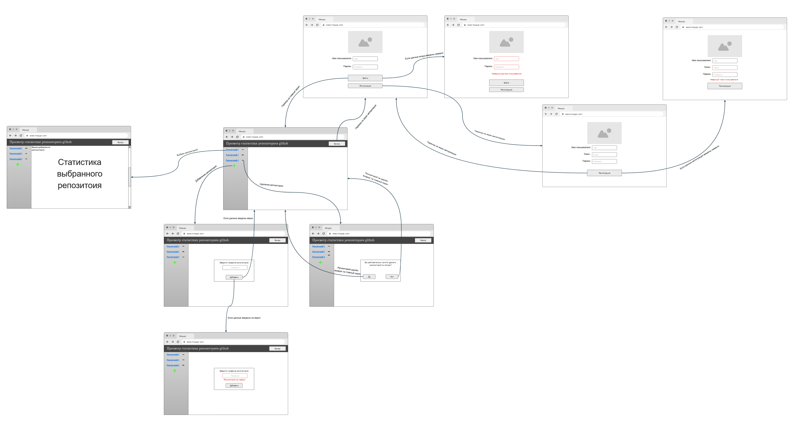

# Use case
## Сценарии использования приложения
### Сценарий "Аутентификации"
##### Основной сценарий
- Пользователь вводит логин и пароль
- Нажимает кнопку войти
- Вход пользователя в систему

##### Альтернативный сценарий
- Пользователь вводит логин и пароль
- Нажимает кнопку войти
- Данные введены не верно
- Повтор сценария

### Сценарий "Регистрация"
- Переход в сценарий происходит в сценрии "Аутентификации"
- Пользователь вводит логин, токен и пароль
- Нажимает на кнопку "Зарегистрироваться"
- Переход в сценрий "Аутентификации"

### Сценарий "Выход"
- Пользователь нажимает на соответствующую кнопку
- Пользователь переходит на страницу аутентификации

### Сценарий "Добавить репозиторий"
##### Основной сценарий
- Пользователь нажимает на кнопку "Добавить репозиторий"
- Пользователь вводит название репозитория
- Репозиторий добавлен в список репозиториев

##### Альтернативный сценарий
- Пользователь нажимает на кнопку "Добавить репозиторий"
- Пользователь вводит название репозитория
- Данные введены не верно
- Повтор сценария

### Сценарий "Удаление репозитория"
- Пользователь нажимает на кнопку "Удалить репозиторий" рядом с выбранным репозиторием
- Пользователю выводится диалоговое окно "Удалить репозиторий или нет"
- Репозиторий удален из списка репозиториев (Если пользователь согласился)
- Репозиторий не удален из списка репозиториев (Если пользователь отказался)

### Сценарий "Просмотр статистики"
- Пользователь нажимает на уже добавленный репозиторий
- Пользователю предоставляется статистика выбранного репозитория

