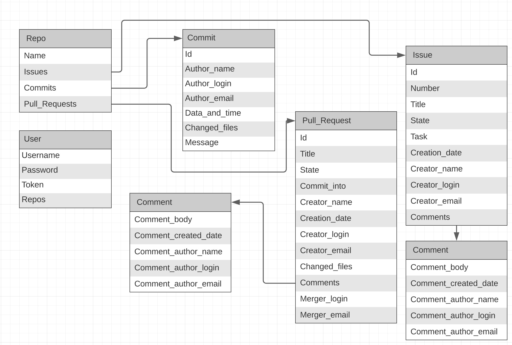
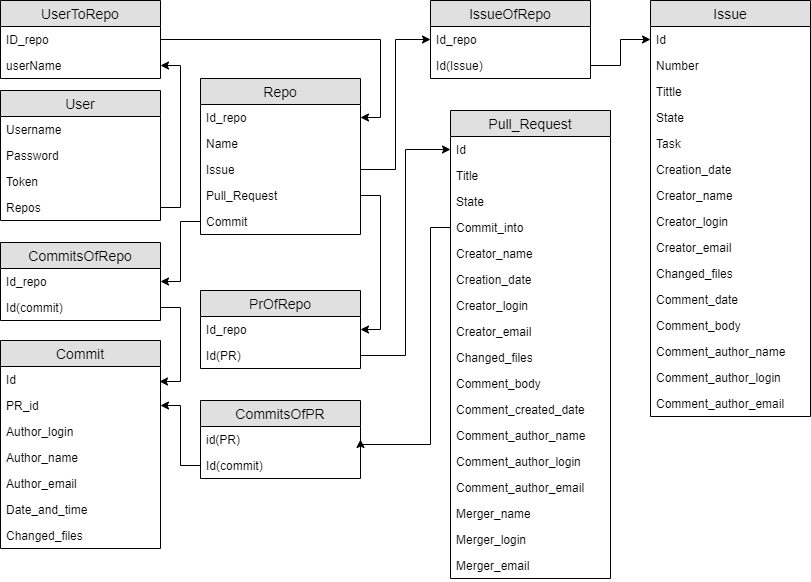
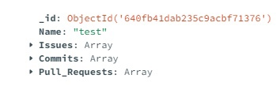
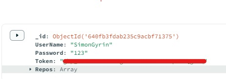

# Модель данных
# Схема БД и список сущностей
База данных содержит информацию о репозиториях, коммитах, пуллреквестах и Issue. Ниже приведен список полей.
### User
- Username
- Password
- Token
- Repos

### Repo
- Name
- Issues
- Commits
- Pull_Requests

### Commit
- Id
- Author_Name
- Author_login
- Author_email
- Data_and_time
- Changed_files
- Message

### Pull_Request
- Id
- Title
- State
- Commit_into
- Creator_name
- Creation_date
- Creator_login
- Creator_email
- Changed_files
- Comments
- Merger_login
- Merger_email

### Issue
- Id
- Number
- Title
- State
- Task
- Creation_date
- Creator_name
- Creator_login
- Creator_email
- Changed_files
- Comments

### Comment
- Comment_body
- Comment_created_date
- Comment_author_name
- Comment_author_login
- Comment_author_email

# Нереляционная модель данных
## Графическое представление

## Оценка удельного объема информации, хранимой в модели
Пусть в базе данных N1 пользователей N2 репозиториев N3 пулреквестов  N4 коммитов и N5 Issue .
Максимальные размеры полей документов:
### User
- UserName: 128 bytes
- Password: 128 bytes
- Token: 93 bytes
- Repos: 760 bytes

Чистый объём документа user:  1109 bytes 

Фактической объём документа user: 1109 bytes 

### Repo
- Name: 256 bytes
- Issues: 760 bytes
- Commits: 760 bytes
- Pull_Requests: 760 bytes

Чистый объём документа Repo:  2536 bytes 

Фактической объём документа Repo: 2536 bytes 

### Commit
- Id: 8 bytes
- Author_Name :128 bytes
- Author_login: 128 bytes
- Author_email: 128 bytes
- Data_and_time: 20 bytes
- Changed_files: 760 bytes
- Message: 408 bytes

Чистый объём документа commit: 1572  bytes 

Фактической объём документа commit: 1580 bytes 

### Pull_Request
- Id: 8 bytes
- Title: 256 bytes
- State: 100 bytes
- Commit_info: 100 bytes
- Creator_name: 128 bytes
- Creation_date: 20 bytes
- Creator_login: 128 bytes
- Creator_email: 128 bytes
- Changed_files: 760 bytes
- Comments: 1404 bytes
- Merger_login: 128 bytes
- Merger_email: 128 bytes

Чистый объём документа Pull_Request: 4684  bytes 

Фактической объём документа Pull_Request: 4692 bytes 

### Issue
- Id: 8 bytes
- Number: 8 bytes
- Title: 256 bytes
- State: 100 bytes
- Task: 1000 bytes
- Creation_date: 20 bytes
- Creator_name: 128 bytes
- Creator_login: 128 bytes
- Creator_email: 128 bytes
- Changed_files: 760 bytes
- Comments: 1404 bytes

Чистый объём документа Issue: 3932  bytes 

Фактической объём документа Issue: 3940 bytes

### Comment
- Comment_body: 1000 bytes
- Comment_created_date: 20 bytes
- Comment_author_name: 128 bytes
- Comment_author_login: 128 bytes
- Comment_author_email: 128 bytes

Чистый объём документа Comment: 1404  bytes 

Фактической объём документа Comment: 1404 bytes 

## Избыточность модели
Пусть в базе данных N1=5 пользователей, N2=10 репозиториев, N3=100 пулреквестов,  N4=120 коммитов, N5=10 Issue и N6=200 комментариев 

Vclear `=` N1`*`1109 `+` N2`*`2536 `+` N3`*`4684 `+` N4`*`1164`+`N5`*`3932 `+` N6`*`1404`=` 5`*`1109 `+` 10`*`2536 `+` 100`*`4684 `+`120`*`1164 `+` 10`*`3932 `+` 200`*`1404 `=` 959105 bytes

Vreal `=` N1`*`1109 `+` N2`*`2536 `+` N3`*`4692 `+` N4`*`1172`+`N5`*`3940 `+` N6`*`1404`=` 5`*`1109 `+` 10`*`2536 `+` 100`*`4692 `+`120`*`1172 `+` 10`*`3940 `+` 200`*`1404 `=` 960945 bytes

Избыточность: Vreal `/` Vclear `=` 960945/959105 `=` 1,00191846

## Направление роста модели при увеличении количества объектов каждой сущности
Размер базы данных растет линейно по каждому параметру.

## Запросы к модели, с помощью которых реализуются сценарии использования
### Добавление
collection.new_commit({
   "Id":1,
   "Author_Name":"Pavel",
   "Author_login":"cirilohysP",
   "Author_email":"realmathsmc@gmail.com",
   "Data_and_time":"2022-12-12 19:58:48",
   "Changed_files":",Новая папка (2)/README.md"
})

### Удаление
collection.delete_commit('id' : '1')

### Обновление
collection.update_commit({"_id" : "1"}, {"$set" : {"Author_Name" :"Pavel Kravchenko"}})

### Поиск по полю
collection.find_commit({"Author_login" : "Dunkel"})

### Сортировка
collection.find().sort("Author_Name")

### Поиск по нескольким полям
collection.find_commit({"Author_Name":"Pavel", "Changed_files":",Новая папка (2)/README.md"})

# Аналог модели данных для SQL СУБД
## Графическое представление

### User
- UserName:128 bytes
- Password: 128 bytes
- Token: 93 bytes

Чистый объём документа user:  349 bytes 

Фактической объём документа user: 349 bytes 

### Repo
- Name: 256 bytes
- Id: 8 bytes
Чистый объём документа Repo:  256 bytes 

Фактической объём документа Repo: 264 bytes 

### Commit

- Id: 8 bytes
- Author_Name: 128 bytes
- Author_login: 128 bytes
- Author_email: 128 bytes
- Data_and_time: 20 bytes
- Changed_files: 760bytes

Чистый объём документа commit: 1164  bytes 

Фактической объём документа commit: 1172 bytes 

### Pull_Request

- Id:8 bytes
- Title:256 bytes
- State: 100 bytes
- Creator_name: 128 bytes
- Creation_date: 20 bytes
- Creator_login: 128 bytes
- Creator_email: 128 bytes
- Changed_files: 760bytes
- Comment_body: 1000 bytes
- Comment_created_date: 20 bytes
- Comment_author_name: 128 bytes
- Comment_author_login: 128 bytes
- Comment_author_email: 128 bytes
- Merger_name: 128 bytes
- Merger_login: 128 bytes
- Merger_email: 128 bytes

Чистый объём документа Pull_Request: 3308  bytes 

Фактической объём документа Pull_Request: 3316 bytes 

### Issue

- Id:8 bytes
- Number:8 bytes
- Title:256 bytes
- State:100 bytes
- Task: 1000 bytes
- Creation_date:20 bytes
- Creator_name:128 bytes
- Creator_login:128 bytes
- Creator_email:128 bytes
- Changed_files:760 bytes
- Comment_date:20 bytes
- Comment_body:1000 bytes
- Comment_author_name:128 bytes
- Comment_author_login:128 bytes
- Comment_author_email:128 bytes

Чистый объём документа Issue: 3932  bytes 

Фактической объём документа Issue: 3940 bytes 

### IssueOfRepo
- Id_repo: 8 bytes
- Id(Issue):8 bytes

Чистый объём документа IssueOfRepo: 0  bytes 

Фактической объём документа IssueOfRepo: 16 bytes 

### UserToRepo
- ID_repo:8 bytes
- userName:8 bytes

Чистый объём документа UserToRepo: 0  bytes 

Фактической объём документа UserToRepo: 16 bytes 

### CommitsOfRepo
- Id_repo:8 bytes
- Id(commit):8 bytes

Чистый объём документа CommitsOfRepo: 0  bytes 

Фактической объём документа CommitsOfRepo: 16 bytes 

### PrOfRepo
- Id_repo:8 bytes
- Id(PR):8 bytes

Чистый объём документа PrOfRepo: 0  bytes 

Фактической объём документа PrOfRepo: 16 bytes 

### CommitsOfPR
- id(PR):8 bytes
- Id(commit):8 bytes

Чистый объём документа PrOfRepo: 0  bytes 

Фактической объём документа PrOfRepo: 16 bytes 

## Оценка удельного объема информации, хранимой в модели
Пусть у нас есть N1=5 пользователей каждый работает в N2=10 репозиториях (все во всех) Имеется по N4=120 коммитов, N3=100 PR и N5=10 Issue

Vclear `=` N1`*`349 `+` N2`*`256 `+` N3`*`3308 `+` N4`*`1164`+`N5`*`3932 `=` 5`*`349 `+` 10`*`256 `+` 100`*`3308 `+`120`*`1164 `+` 10`*`3932 `=` 514105 bytes

Vreal `=` N1`*`349 `+` N2`*`264 `+` N3`*`3316 `+` N4`*`1172`+`N5`*`3940`+`N1`*`N2`*`16`+`N3`*`N2`*`16`+`N4`*`N2`*`16`+`N5`*`N2`*`16+N4`*`16`=` 5`*`349 `+` 10`*`264 `+` 100`*`3316 `+`120`*`1172 `+` 10`*`3940 `+`5`*`10`*`16`+`100`*`10`*`16`+`120`*`10`*`16`+`10`*`10`*`16+120`*`16`=` 555545 bytes

Тогда по сравнению с нереаляционной мы задействуем на N2`*`(N1+N3+N4+N5)`*`(8+8)+N4`*`(8+8) `=` 39520 bytes на свяжуюшие таблицы, но сэкономим на Полях перечисления N1`*`(1109-349) `+` N2`*`(2544-264) `+` N3`*`(3416-3316) `+` N4`*`(1172-1172)`+` N5`*`(3940-3940) `=` 5`*`760 `+` 10`*`2280 `+` 100`*`100 `+` 120`*`0 `+` 10 `*`0 `=` 36600 bytes.

 Разница фактического веса моделей при заданных данных равна: 555545 `-` 552625 = 2920 bytes 

## Избыточность модели
Избыточность: Vreal `/` Vclear `=` 555545/514105 `=` 1,08060610187

## Направление роста модели при увеличении количества объектов каждой сущности
Размер базы данных растет линейно по каждому параметру.

## Запросы к модели, с помощью которых реализуются сценарии использования
### Добавление
INSERT INTO Commit
VALUES
(...);

### Удаление
DELETE FROM Commit
WHERE id == 1;

### Обновление
UPDATE commit
  SET Author_Name = Pavel Kravchenko
  WHERE id == 1;

### Поиск по полю
SELECT *
  FROM commit
  WHERE Author_login = Dunkel;

### Сортировка
SELECT *
  FROM commit
  ORDERED BY Author_Name ASC;

### Поиск по нескольким полям
SELECT *
  FROM commit
  WHERE Author_Name = Pavel AND Changed_files="Новая папка (2)/README.md"
  
## Пример представления данных в базе данных

## Сравнение моделей
В данной модели обнаруженно преимущество нереляционной модели всясвязи с отсутствием накладных данных на таблицы связи, которые покрываются списками в одной сущности.
